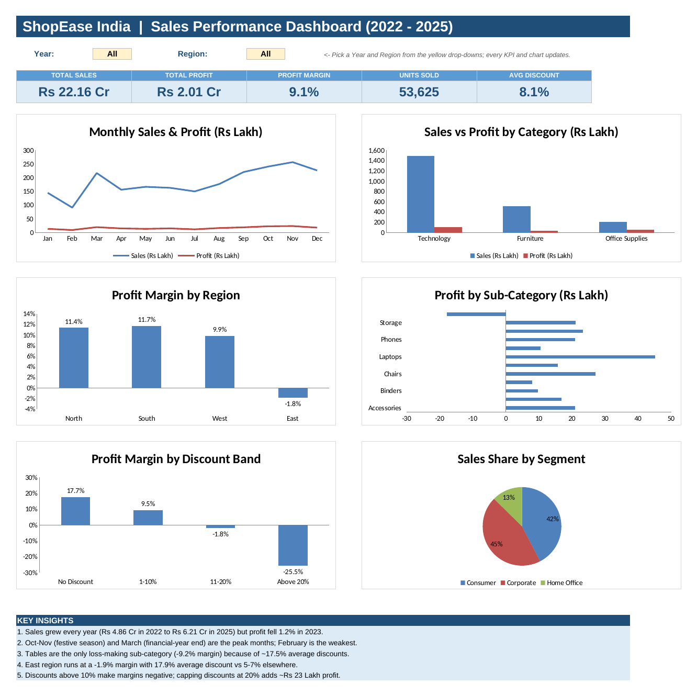
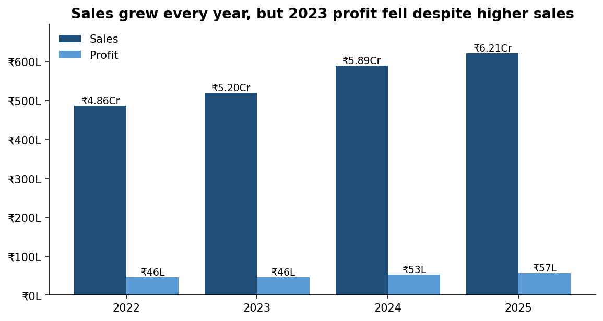
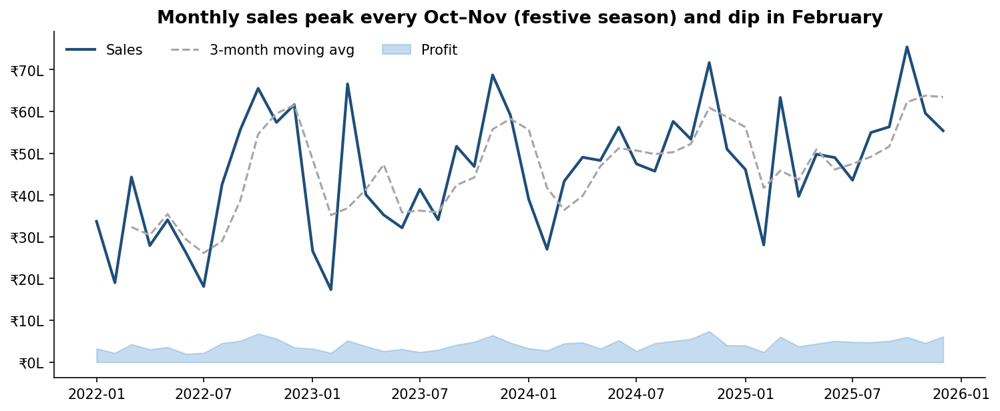
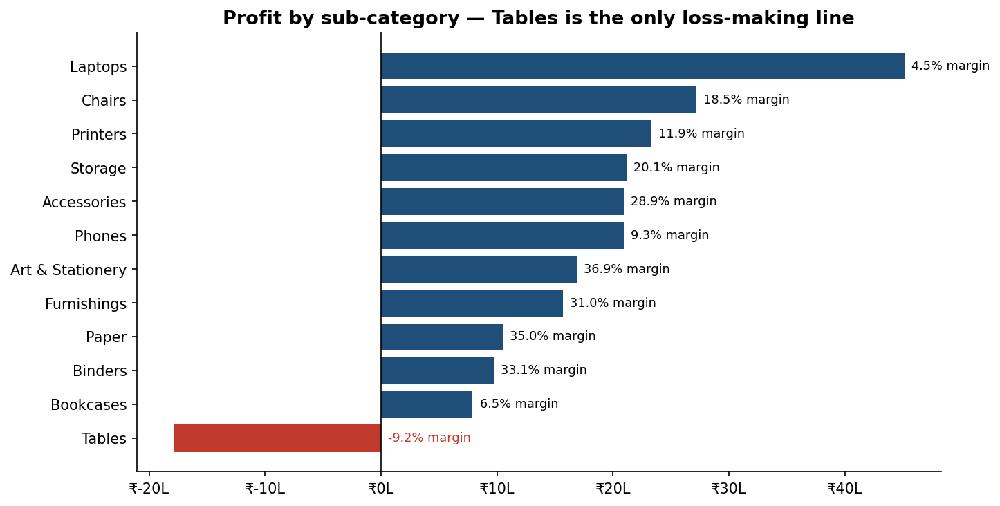
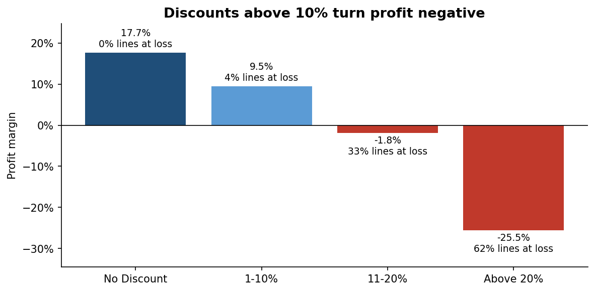
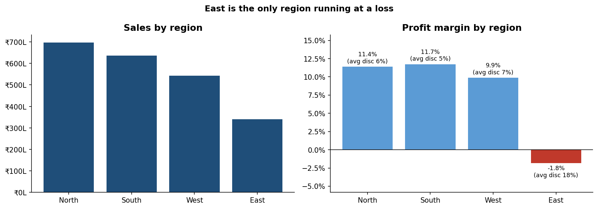
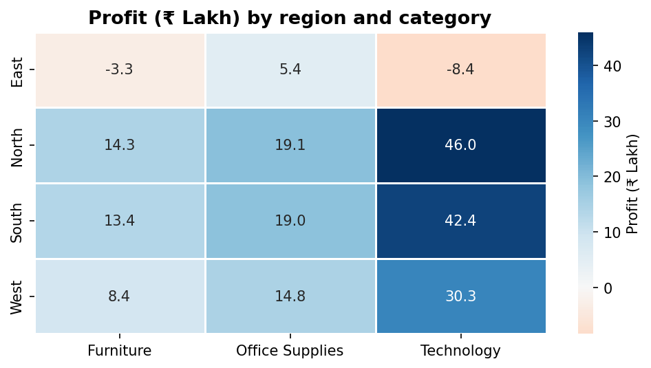
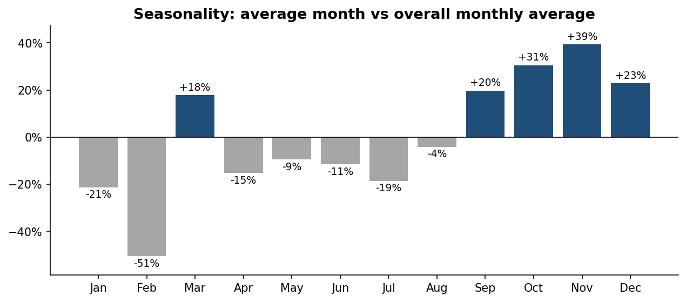
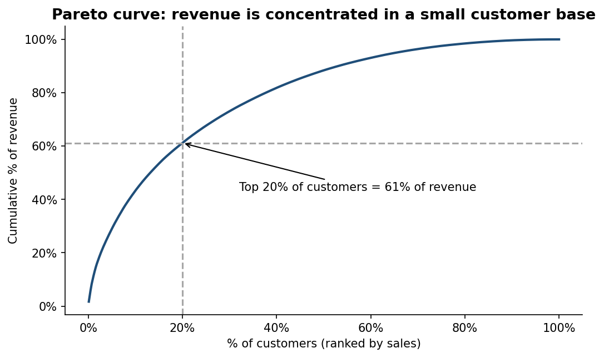

# 📊 Sales Performance Analysis — ShopEase India (2022–2025)


An end-to-end sales analytics project: **raw data → cleaning (Python & SQL) → 30 SQL business queries →
exploratory analysis in Python → interactive Excel dashboard → Tableau dashboard → business recommendations.**

> **Headline finding:** revenue grew 28% from 2022 to 2025, but heavy discounting (>10%) in the **East region**
> and on **Tables** is wiping out profit. Capping discounts at 20% would add **≈ ₹23 Lakh (+11.5%) profit**.

🔗 **Live Tableau dashboard:** _add your Tableau Public link here after publishing (see [`dashboard/TABLEAU_DASHBOARD_GUIDE.md`](dashboard/TABLEAU_DASHBOARD_GUIDE.md))_



---

## 📌 Table of Contents
- [Business Problem](#-business-problem)
- [Dataset](#-dataset)
- [Tools & Skills](#-tools--skills)
- [Project Workflow](#-project-workflow)
- [Data Cleaning](#-data-cleaning)
- [SQL Analysis](#-sql-analysis)
- [Key Insights](#-key-insights)
- [Recommendations](#-recommendations)
- [Dashboards](#-dashboards)
- [How to Run](#-how-to-run)
- [Project Structure](#-project-structure)

---

## 🎯 Business Problem
ShopEase India sells **Technology, Furniture and Office Supplies** to consumers and businesses across
**17 cities in 4 regions**. Sales are growing, but profit is not keeping pace. Management asked:

1. How are sales and profit trending — yearly, monthly and seasonally?
2. Which categories, sub-categories and products make or lose money?
3. Which regions and customer segments perform best?
4. How is discounting affecting margins?
5. What actions will improve profitability?

## 🗂 Dataset
| Item | Detail |
|------|--------|
| Period | 1 Jan 2022 – 31 Dec 2025 (4 years) |
| Raw rows | 9,947 order lines × 20 columns |
| Clean rows | 9,880 order lines × 29 columns |
| Orders / Customers / Products | 5,198 / 816 / 48 |
| Currency | Indian Rupees (₹) — 1 Lakh = 1,00,000 · 1 Crore = 1,00,00,000 |

**Columns:** Order ID, Order Date, Ship Date, Ship Mode, Customer ID, Customer Name, Segment, City, State,
Region, Product ID, Category, Sub-Category, Product Name, Quantity, Unit Price, Discount, Sales, Profit.

> **Data note:** the dataset is synthetic, generated by [`scripts/generate_data.py`](scripts/generate_data.py) to
> mirror a real Indian retailer — year-on-year growth, a Diwali-season peak, March financial-year-end buying,
> region-specific discounting and realistic data-quality problems. Using a generator keeps the project fully
> reproducible (fixed random seed).

## 🛠 Tools & Skills
| Tool | Used for |
|------|----------|
| **Python** (pandas, NumPy) | Data cleaning, feature engineering, validation |
| **Python** (matplotlib, seaborn) | Exploratory analysis & 8 charts |
| **SQL** (SQLite) | Data-quality profiling, SQL cleaning pipeline, 22 business queries, window functions, CTEs |
| **Excel** | Interactive dashboard — SUMIFS / AVERAGEIFS formulas, drop-down filters, KPI cards, 6 charts |
| **Tableau** | Interactive dashboard with map, parameters and filters |
| **Power BI (DAX)** | Optional version — time-intelligence and what-if measures |

## 🔄 Project Workflow
```
 sales_raw.csv ──► clean_data.py / 03_data_cleaning.sql ──► sales_clean.csv
                                                              │
        ┌──────────────────────┬──────────────────────┬───────┴──────────────┐
        ▼                      ▼                      ▼                      ▼
  SQL analysis (30)    Python EDA notebook    Excel dashboard        Tableau / Power BI
        └──────────────────────┴──────────┬───────────┴──────────────────────┘
                                          ▼
                              Insights & recommendations
```

## 🧹 Data Cleaning
The raw file contained realistic problems. Each was found with SQL profiling
([`sql/02_data_quality_checks.sql`](sql/02_data_quality_checks.sql)) and fixed in **both** Python and SQL:

| Issue found | Rows | Fix |
|-------------|------|-----|
| Exact duplicate rows | 55 | Removed (`drop_duplicates` / `SELECT DISTINCT`) |
| Inconsistent text — `" north"`, `NORTH`, `TECHNOLOGY  ` | 630 | Trimmed spaces, standardised casing |
| Dates stored as `DD-MM-YYYY` text | all | Converted to proper `YYYY-MM-DD` dates |
| Zero / negative quantity | 12 | Removed as data-entry errors |
| Missing customer names | 43 | Filled from the same Customer ID's other orders |
| Missing ship dates | 60 | Order date + **median** shipping days for that ship mode |

Derived columns added: `Order Year`, `Order Month`, `Quarter`, `Year-Month`, `Shipping Days`,
`Profit Margin`, `Discount Band`, `Is Loss`.

✅ **Validation:** the Python output and the SQL output were compared column by column — all 28 shared
columns and 9,880 rows match exactly.

## 🧮 SQL Analysis
All SQL is in [`/sql`](sql) and runs with one command (`python scripts/run_sql.py`). Results for every query
are saved to [`outputs/SQL_RESULTS.md`](outputs/SQL_RESULTS.md).

| File | What it does |
|------|--------------|
| `01_create_tables.sql` | Typed schema with constraints and indexes |
| `02_data_quality_checks.sql` | 7 profiling queries on the raw data |
| `03_data_cleaning.sql` | Full cleaning pipeline in one `INSERT … SELECT` with CTEs and a window-function median |
| `04_business_analysis.sql` | 14 business queries — KPIs, YoY growth, seasonality, category, region, segment, discounts, customers, products |
| `05_advanced_analysis.sql` | 8 advanced queries — running totals, MoM/YoY with `LAG`, `DENSE_RANK`, `NTILE` Pareto, CASE pivot, what-if |

<details>
<summary><b>Example — YoY growth with window functions</b></summary>

```sql
WITH yearly AS (
    SELECT order_year, SUM(sales) AS sales, SUM(profit) AS profit
    FROM sales
    GROUP BY order_year
)
SELECT
    order_year,
    ROUND(sales / 1e5, 2)  AS sales_lakh,
    ROUND(100.0 * (sales - LAG(sales) OVER (ORDER BY order_year))
          / LAG(sales) OVER (ORDER BY order_year), 2) AS sales_yoy_pct
FROM yearly;
```
| order_year | sales_lakh | profit_lakh | margin_pct | sales_yoy_pct | profit_yoy_pct |
|---|---|---|---|---|---|
| 2022 | 485.84 | 46.06 | 9.48 | – | – |
| 2023 | 519.70 | 45.51 | 8.76 | 6.97 | **−1.20** |
| 2024 | 589.42 | 52.86 | 8.97 | 13.42 | 16.15 |
| 2025 | 620.92 | 56.95 | 9.17 | 5.34 | 7.73 |
</details>

<details>
<summary><b>Example — what-if: cap discounts at 20%</b></summary>

```sql
WITH capped AS (
    SELECT region, profit,
           CASE WHEN discount > 0.20
                THEN profit + sales / (1 - discount) * (discount - 0.20)
                ELSE profit END AS profit_if_capped
    FROM sales
)
SELECT region,
       ROUND(SUM(profit) / 1e5, 2)                           AS actual_profit_lakh,
       ROUND(SUM(profit_if_capped) / 1e5, 2)                 AS profit_if_capped_lakh,
       ROUND((SUM(profit_if_capped) - SUM(profit)) / 1e5, 2) AS uplift_lakh
FROM capped
GROUP BY region
ORDER BY uplift_lakh DESC;
```
| region | actual_profit_lakh | profit_if_capped_lakh | uplift_lakh |
|---|---|---|---|
| East | −6.29 | 12.65 | 18.94 |
| West | 53.52 | 56.46 | 2.94 |
| North | 79.39 | 80.30 | 0.91 |
| South | 74.77 | 75.18 | 0.41 |
</details>

> SQL is written for **SQLite**. For MySQL use `YEAR(order_date)` / `DATE_FORMAT(order_date, '%Y-%m')`
> instead of `STRFTIME`, and `DATEDIFF` instead of `julianday`. For PostgreSQL use `EXTRACT` / `TO_CHAR`.

## 💡 Key Insights

**KPIs (2022–2025):** Sales **₹22.16 Cr** · Profit **₹2.01 Cr** · Margin **9.1%** · Orders **5,198** ·
Customers **816** · Avg order value **₹42,630**

| # | Insight |
|---|---------|
| 1 | **Growth without profit (2023).** Sales rose 7.0% in 2023 but profit *fell* 1.2% and margin dropped to 8.8%. |
| 2 | **Strong seasonality.** November is +39% and October +31% above an average month (festive season); March +18% (financial-year end); February −51%. |
| 3 | **Technology = revenue, Office Supplies = margin.** Technology is 67% of sales at 7.4% margin; Office Supplies is 9.5% of sales at **27.7%** margin. |
| 4 | **Tables lose money.** The only loss-making sub-category: −₹17.9 L profit, −9.2% margin, 17.5% average discount — every table product loses money. |
| 5 | **East region is loss-making.** −1.8% margin with a 17.9% average discount vs 5–7% in other regions. |
| 6 | **Discounts > 10% destroy profit.** 11–20% discount → −1.8% margin; > 20% → −25.5% margin with 62% of lines at a loss. |
| 7 | **Revenue is concentrated.** Top 20% of customers generate **61%** of revenue. |
| 8 | **Discount cap = quick win.** Capping discounts at 20% adds **≈ ₹23.2 L** (+11.5%) profit, ₹18.9 L from East alone. |

| | |
|---|---|
|  |  |
|  |  |
|  |  |
|  |  |

## ✅ Recommendations
1. **Discount approval policy** — cap standard discounts at 20%; manager approval for anything above 10% on Furniture.
2. **Fix Tables pricing** — renegotiate supplier cost or reduce discounting; stop selling below cost.
3. **East region turnaround** — sales-team training on value selling; track average discount % weekly.
4. **Plan for peaks** — stock up and schedule campaigns for Sep–Dec and March.
5. **Grow high-margin Office Supplies** — bundle stationery and storage with corporate laptop / printer orders.
6. **Key-account programme** for the top 20% of customers who bring in 61% of revenue.

## 📈 Dashboards
| Dashboard | File | Highlights |
|-----------|------|-----------|
| **Excel** | [`dashboard/Sales_Dashboard.xlsx`](dashboard/Sales_Dashboard.xlsx) | Year & Region drop-downs, 5 KPI cards, 6 charts, all driven by live `SUMIFS` formulas |
| **Tableau** | [Build guide](dashboard/TABLEAU_DASHBOARD_GUIDE.md) | India map, metric-switch parameter, dashboard-wide filters |
| **Power BI** | [DAX measures](dashboard/POWER_BI_DAX_MEASURES.md) | Date table, YoY / YTD time intelligence, what-if measure |

> Download the Excel file and change the yellow **Year** / **Region** cells — every KPI and chart updates.

## ▶ How to Run
```bash
git clone https://github.com/satvik89010/sales-performance-analysis.git
cd sales-performance-analysis
pip install -r requirements.txt

python run_all.py                     # generate → clean → SQL → Excel dashboard
jupyter notebook notebooks/sales_performance_analysis.ipynb
```

## 📁 Project Structure
```
sales-performance-analysis/
├── data/
│   ├── raw/sales_raw.csv                 # raw data with quality issues
│   └── processed/sales_clean.csv         # analysis-ready data
├── sql/
│   ├── 01_create_tables.sql
│   ├── 02_data_quality_checks.sql
│   ├── 03_data_cleaning.sql
│   ├── 04_business_analysis.sql
│   └── 05_advanced_analysis.sql
├── scripts/
│   ├── generate_data.py
│   ├── clean_data.py
│   ├── run_sql.py
│   └── build_excel_dashboard.py
├── notebooks/sales_performance_analysis.ipynb
├── dashboard/
│   ├── Sales_Dashboard.xlsx
│   ├── TABLEAU_DASHBOARD_GUIDE.md
│   └── POWER_BI_DAX_MEASURES.md
├── outputs/
│   ├── SQL_RESULTS.md                    # every query + its result
│   └── sql_results/*.csv
├── images/                               # charts used in this README
├── run_all.py
├── requirements.txt
└── README.md
```

## 👤 Author
**Satvik Mansotra** — Data Analyst
📧 mansotrasatvik@gmail.com · 💼 [LinkedIn](https://www.linkedin.com/in/satvik09) · 📍 Gurugram, India

⭐ If you found this project useful, please star the repository!
